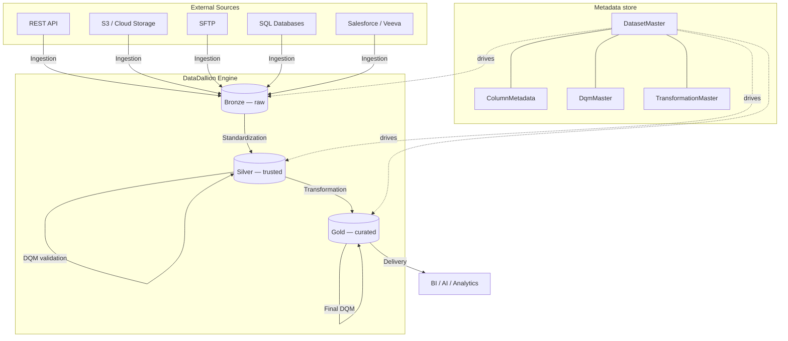

<p align="center">
  
</p>

<p align="center">
  <a href="https://opensource.org/licenses/Apache-2.0"></a>
  <a href="https://www.python.org/"></a>
  <a href="#architecture"></a>
  <a href="https://pypi.org/project/data-dallion-framework/"></a>
</p>

🚧 **Work in Progress** 🚧

**DataDallion Framework** is a metadata-driven data engineering framework for building and orchestrating [Medallion Architecture](https://www.databricks.com/glossary/medallion-architecture) pipelines. Define your entire pipeline — sources, schemas, quality rules, and transformations — in a central metadata store. DataDallion handles the rest.

---

## Table of contents

- [Architecture](#architecture)
- [Features](#features)
- [Prerequisites](#prerequisites)
- [Installation](#installation)
- [Configuration](#configuration)
- [Quick start](#quick-start)
- [Metadata models](#metadata-models)
- [Supported connectors](#supported-connectors)
- [Data quality checks](#data-quality-checks)
- [Business Standard Operating Procedure (SOP)](docs/BUSINESS_SOP.md)
- [Technical Standard Operating Procedure (SOP)](docs/TECHNICAL_SOP.md)
- [KMS & Secrets Guide](docs/KMS_DOCUMENTATION.md)
- [Contributing](#contributing)
- [License](#license)

---

## Architecture

DataDallion strictly follows the Medallion Architecture. Data moves through three layers, each adding a level of quality and structure.

For a comprehensive overview of the business goals and data flow, see the [Business SOP](docs/BUSINESS_SOP.md). For detail on developer execution models and sequence flows, see the [Technical SOP](docs/TECHNICAL_SOP.md).



---

## Features

- **Metadata-driven orchestration** — define sources, schemas, quality rules, and transformations entirely through configuration. No pipeline code changes required when onboarding a new dataset. See the [Onboarding SQL Guide](docs/TECHNICAL_SOP.md#3-onboarding-step-by-step-sql-guide).
- **Multi-source ingestion** — built-in connectors for REST APIs, SFTP, AWS S3, Salesforce, Veeva, and any JDBC-compatible database. Read more in the [Metadata Schema Documentation](docs/TECHNICAL_SOP.md#2-relational-metadata-schema-all-13-tables).
- **Automated data quality** — a pluggable DQM engine validates nullability, data types, string patterns, domain values, uniqueness, and custom SQL rules. Critical failures halt the pipeline; warnings are logged and pass through. See the [DQM Framework Details](docs/TECHNICAL_SOP.md#6-data-quality-management-dqm-validation-framework).
- **SCD Type 2 support** — Gold-layer transformations maintain full change history using Delta Lake merge with checksum-based change detection. Learn about [SCD Type 2 Logic](docs/TECHNICAL_SOP.md#gold-layer-slowly-changing-dimension-scd-type-2-logic).
- **Parallel execution** — Bronze, Silver, and Gold layers each process datasets concurrently using `ThreadPoolExecutor`. See [Execution Model Details](docs/TECHNICAL_SOP.md#1-technical-standpoint--execution-model).
- **Comprehensive audit trail** — every extraction, standardization, DQM check, and transformation step is logged to the metadata store with batch IDs, start/end times, and exception details. See [Audit & Log Tables](docs/TECHNICAL_SOP.md#b-audit--log-tables).
- **Pluggable backends** — the metadata store works with SQLite (zero-config default), MySQL, PostgreSQL, and MariaDB.

---

## Prerequisites

Before installing DataDallion, ensure the following are available in your environment.

| Requirement | Version | Notes |
|-------------|---------|-------|
| Python | 3.12+ | |
| Java | 11 or 17 | Required by PySpark |
| Apache Spark | 4.x | Install via the `extras` optional dependency |
| Delta Lake | compatible with Spark 4.x | Install via the `extras` optional dependency |

---

## Installation

We recommend [uv](https://github.com/astral-sh/uv) for dependency management.

```bash
# From PyPI
pip install data-dallion-framework

# With PySpark + Delta Lake support
pip install "data-dallion-framework[extras]"

# With MySQL/MariaDB backend support
pip install "data-dallion-framework[sql-backend]"
```

**From source:**

```bash
git clone https://github.com/henry-richard7/data-dallion-framework.git
cd data-dallion-framework
uv sync
```

---

## Configuration

DataDallion reads configuration from environment variables or a `.env` file in your working directory.

| Variable | Description | Default |
|----------|-------------|---------|
| `DATABASE_URL` | Full SQLAlchemy connection string (overrides all other DB vars) | — |
| `DB_TYPE` | Backend type: `sqlite`, `mysql`, `postgresql`, `mariadb` | `sqlite` |
| `DB_NAME` | Database name | `nextgen_framework_configuration` |
| `DB_HOST` | Database host | `localhost` |
| `DB_PORT` | Database port (auto-detected per DB type if omitted) | — |
| `DB_USER` | Database username | — |
| `DB_PASSWORD` | Database password | — |
| `DATACRAFT_FRAMEWORK_HOME` | Root directory for local SQLite file storage | `~/datacraft_framework` |

**Example `.env` for MySQL:**

```env
DB_TYPE=mysql
DB_HOST=localhost
DB_NAME=datadallion_config
DB_USER=myuser
DB_PASSWORD=mypassword
```

> **Security note** — Credential values in configuration tables (like passwords, keys, or client secrets in `sa_column` fields or JSON configurations) can be stored securely using the integrated **Key Management System (KMS)**. AWS Secrets Manager, Azure Key Vault, HashiCorp Vault, and local symmetric Fernet encryption are supported natively. Refer to the [KMS & Secrets Integration Guide](docs/KMS_DOCUMENTATION.md) for full instructions.

---

## Quick start

### 1. Seed the metadata store

Use the provided sample script as a reference for setting up your first dataset. It seeds the metadata store with a JSONPlaceholder API dataset end-to-end.

```bash
python tests/setup_sample_api.py
```

See [`tests/setup_sample_api.py`](tests/setup_sample_api.py) for a complete annotated example of how to register a dataset, configure its source, define column mappings, and set DQM rules.

### 2. Run the pipeline

```python
from pyspark.sql import SparkSession
from delta import configure_spark_with_delta_pip

from data_dallion_framework.BronzeScripts import PerformBronze
from data_dallion_framework.SilverScripts import SilverLayerProcess
from data_dallion_framework.GoldScripts import PerformGoldLayerProcess

builder = (
    SparkSession.builder
    .appName("DataDallion")
    .config("spark.sql.extensions", "io.delta.sql.DeltaSparkSessionExtension")
    .config("spark.sql.catalog.spark_catalog", "org.apache.spark.sql.delta.catalog.DeltaCatalog")
)
spark = configure_spark_with_delta_pip(builder).getOrCreate()

process_id = 1  # matches your ctlDatasetMaster entries

# Bronze — extract from sources and land as Delta tables
bronze = PerformBronze.PerformBronze(spark, process_id)
bronze.start_extraction()

# Silver — standardize and validate
SilverLayerProcess.SilverLayerProcess(spark, process_id)

# Gold — transform and publish
PerformGoldLayerProcess.GoldLayerProcess(spark, process_id)
```

---

## Metadata models

The pipeline is entirely driven by the following configuration tables. All are created automatically on first run.

| Table | Purpose |
|-------|---------|
| `ctlDatasetMaster` | Central registry for every dataset — paths for each layer, partition columns, table names, and table type (managed/external). |
| `ctlColumnMetadata` | Source-to-target column mapping, data types, date formats, and JSON path expressions for API sources. |
| `ctlDataAcquisitionDetail` | Per-dataset ingestion config — source platform, file patterns, SQL query, and credential identifier. |
| `ctlDataAcquisitionConnectionMaster` | Stores connection credentials (host, port, keys) keyed by platform and credential identifier. |
| `ctlApiConnectionsDtl` | Step-by-step API workflow config including auth type, token URLs, request bodies, and pagination. |
| `ctlDqmMasterDtl` | Data quality rules — check type, parameters, criticality level, and pass/fail thresholds. |
| `ctlDataStandardisationDtl` | Column-level transformation rules (trim, pad, replace, case conversion, substring). |
| `ctlTransformationDependencyMaster` | Defines join, union, and aggregation logic for Gold-layer transformations. |

---

## Supported connectors

| Connector | Platform value | Notes |
|-----------|---------------|-------|
| REST API | `API` | Supports OAuth, JWT, Basic Auth, and custom auth flows. Handles pagination and multiplexed requests. |
| SFTP | `SFTP` | Password and SSH key authentication via Paramiko. |
| AWS S3 | `S3` | Supports custom endpoints (MinIO, etc.) and configurable signature versions. |
| Salesforce | `SALESFORCE` | OAuth 2.0 client credentials. Handles pagination via `nextRecordsUrl`. |
| Veeva | `VEEVA` | Same connector as Salesforce. |
| JDBC database | `DATABASE_*` | Any Spark-compatible JDBC driver. Pass connection config and a SQL query. |

---

## Data quality checks

The DQM engine supports the following check types, configurable per column in `ctlDqmMasterDtl`.

| `qc_type` | Description | `qc_param` example |
|-----------|-------------|-------------------|
| `Null` | Fails if column contains null values | — |
| `Blank` | Fails if column contains empty or whitespace-only strings | — |
| `Length` | Validates string length against an operator + value | `>=10`, `=8` |
| `Length-Range` | Validates string length falls within a range | `[5, 20]` |
| `Integer` | Validates value is a valid integer | — |
| `Decimal` | Validates value is a valid decimal number | — |
| `Date` | Validates value matches a date format | `yyyy-MM-dd'T'HH:mm:ssZ` |
| `Regex` | Validates value matches a regular expression | `^[A-Z]{2}[0-9]{6}$` |
| `Domain` | Validates value is within an allowed set | `ACTIVE,INACTIVE,PENDING` |
| `Unique` | Validates uniqueness across one or more columns | `order_id,product_id` |
| `Custom` | Runs an arbitrary SQL expression | `amount > 0 AND currency IS NOT NULL` |

Each rule has a `criticality` (`C` = critical, `W` = warning) and a `criticality_threshold_pct`. A critical rule that exceeds its threshold halts the pipeline and logs the failure. Warning rules log but allow processing to continue.

---

## Contributing

Contributions are welcome. Please read [CONTRIBUTING.md](CONTRIBUTING.md) before opening a pull request.

By submitting a pull request you agree that your contribution will be licensed under the Apache License 2.0.

---

## License

Licensed under the [Apache License 2.0](LICENSE).

---

<p align="center">Built for Data Engineers.</p>
