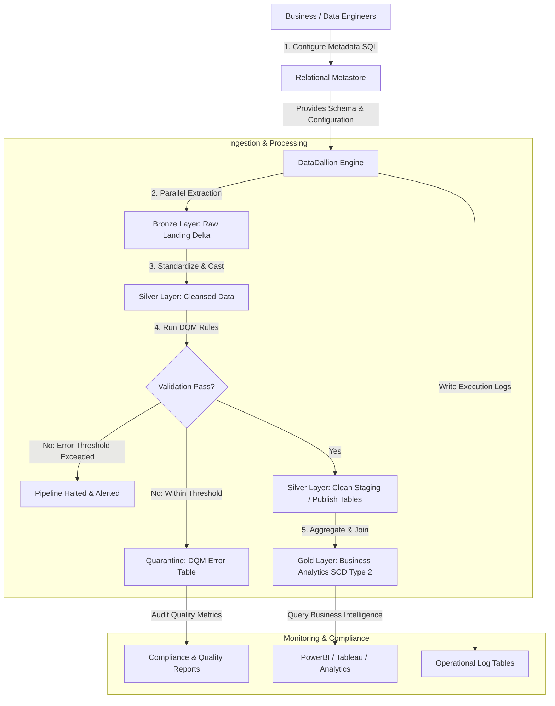

# Business Standard Operating Procedure (SOP): DataDallion Framework

This document outlines the standard procedures for configuring, executing, and maintaining data pipelines using the **DataDallion Framework** from a **Business** standpoint. It covers the business rationale, Medallion Architecture alignment, and high-level process flows.

For low-level configuration details, table schemas, onboarding guides, and troubleshooting, please refer to the [Technical Standard Operating Procedure (SOP)](file:///g:/Coding/Python/data-dallion-framework/docs/TECHNICAL_SOP.md).

---

## 1. Business Standpoint & Architecture Overview

### Business Rationale & Alignment
In modern enterprise data environments, hand-coding individual ingestion pipelines leads to high maintenance costs, inconsistent data quality, lack of auditability, and delayed time-to-market. The **DataDallion Framework** solves these issues by providing a **metadata-driven data orchestration engine** aligned with the **Medallion Architecture**.

By configuring dataset properties in a relational metadata store rather than writing custom ingestion scripts, the business achieves:
1. **Accelerated Time-to-Market:** Onboarding a new dataset requires only metadata registration (SQL inserts), reducing development time from days to minutes.
2. **Unified Data Governance:** Centralized management of dataset columns, quality rules, and processing logic.
3. **Regulatory & Compliance Enforcement:** Automated Key Management System (KMS) integration ensures credentials are never stored in plaintext. Strict data quality management (DQM) checks prevent non-compliant data from reaching analytical layers.
4. **Data Auditability & Lineage:** Granular execution logs capture batch status, processed files, processing durations, and data quality failure rates for comprehensive operational oversight.

### Business Medallion Layers
The framework processes datasets sequentially through three standard business layers:
* **Bronze Layer (Raw landing):** Extracts data from external source endpoints (APIs, S3, SFTP, Databases, Salesforce) and lands them in raw format.
* **Silver Layer (Standardization & Validation):** Applies uniform cleaning rules (trimming, padding, substring extraction, lower/upper casing) and enforces strict validation checks to quarantine dirty records.
* **Gold Layer (Business Analytics):** Joins, aggregates, and processes clean tables into business-ready reports, applying **Slowly Changing Dimension (SCD) Type 2** logic to track historical changes.

### Business Data & Metadata Process Flow

